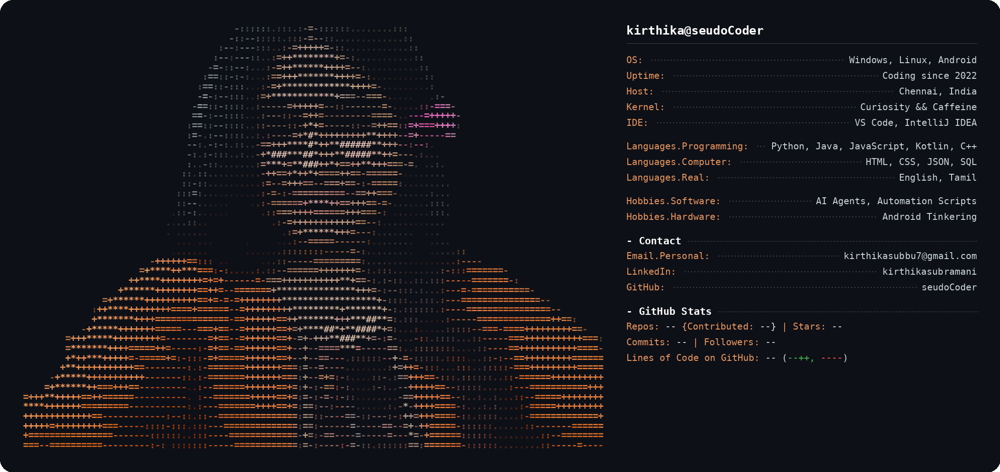

<p align="center">
  
</p>

```bash
$ cat about_me.txt
```

> 🖥️  CS engineer who builds AI-powered developer tooling and automation for fun
> 💸  Deep interest in fintech — payments, ledgers, crypto systems, and the plumbing behind money
> ⚡  Curious, fast-learning, obsessed with turning ideas into clean scalable systems
> 🌱  B.Tech CS & Business Systems @ SASTRA University · Chennai, India

```bash
$ ./run --project featured
```

<table>
<tr>
<td width="50%">

### 💰 CryptoWise
```
> GPT-4 powered crypto portfolio assistant
> fetches live wallet balances, market data & news
> generates personalized risk & trend insights
> stack: GPT-4 API · Python · REST
```
</td>
<td width="50%">

### 🤖 AI Inference Infrastructure
```
> FastAPI service for real-time model predictions
> Hugging Face transformers under the hood
> observability + health-check endpoints
> stack: FastAPI · Hugging Face · Docker
```
</td>
</tr>
<tr>
<td width="50%" colspan="2">

### 🎓 Community Apps
```
> role-based admin APIs for campus-wide events
> real-time score-update APIs for inter-college sports
> modular services: merch, accommodation, logistics
> stack: REST APIs · Backend Services
```
</td>
</tr>
</table>

```bash
$ ls -la ./skills
```

<p align="left">
  
  
  
  
  
  
  
  
  
  
  
  
  
  
</p>

```bash
$ curl -s api.github-stats.com/seudoCoder
```

<p align="center">
  
  <!--  -->
</p>

```bash
$ cat community.log
```

> 🚩 Core Team Member — Team 1nf1n1ty (Cybersecurity CTF)
> 🤖 GDSC Android Development Lead 2025
> 📡 CISCO Campus Ambassador 2025

```bash
$ echo $CONTACT
```

<p align="center">
  <a href="https://www.linkedin.com/in/kirthikasubramani/"></a>
  <a href="mailto:kirthikasubbu7@gmail.com"></a>
  <a href="https://github.com/seudoCoder"></a>
</p>

<p align="center">
  
</p>

<p align="center">
  <sub>$ exit 0</sub>
</p>
